# Driving School Booking

Full-stack TypeScript monorepo for driving school management. Functionality includes but is not limited to booking, lesson lifecycle, messaging, and a separate observability service. Built as a portfolio project.


## Try it locally

<details>
<summary><b>Docker - one command</b></summary>

```sh
git clone git@github.com:anton-avrelinex/driving-school-booking.git
cd driving-school-booking
cp .env.example .env
docker compose up
```

> On Windows `cmd.exe`, use `copy .env.example .env` instead of `cp`. PowerShell and Git Bash both accept `cp`.

Open **http://localhost** and log in:

| Role       | Email             | Password      |
| ---------- | ----------------- | ------------- |
| Admin      | `admin@demo.com`  | `admin123`    |
| Instructor | `erik@demo.com`   | `password123` |
| Student    | `sophie@demo.com` | `password123` |

(Other demo users: `maria@`, `lars@` as instructors; `tom@`, `anna@`, `lukas@`, `emma@` as students - all `password123`.)

To bootstrap admin-only (no demo data), delete the `DEMO_USERS_PASSWORD` line in root `.env` before `docker compose up`.

</details>

<details>
<summary><b>Local - databases in Docker, apps on host</b></summary>

```sh
git clone git@github.com:anton-avrelinex/driving-school-booking.git
cd driving-school-booking
pnpm install
pnpm setup

docker compose up -d postgres mongo redis

cd apps/main-service
pnpm exec prisma migrate deploy
pnpm exec prisma db seed
cd ../..

pnpm dev
```

Then **http://localhost:5173**.

</details>

## Architecture

Three services behind nginx, two databases, one queue between them.

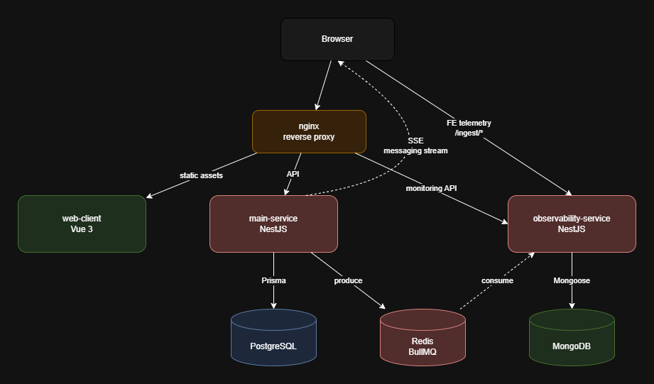

- dashed line means asynchronous (queue or server-push)
- FE telemetry is sent in batches

## Walkthrough

A school is the tenant. Currently there are 3 roles: Admin, Instructor, Student.

The main flow is creating and tracking lessons. Here's how it looks from scratch:

### 1. Admin sets up the school

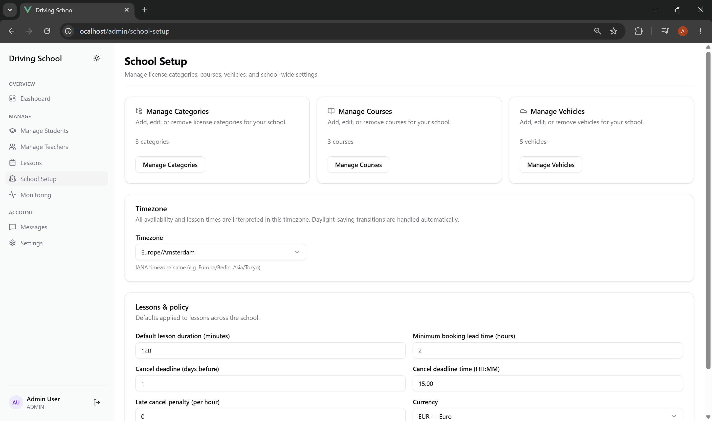

The admin adds the cars, courses, students and instructors. Admin then assigns courses and vehicles to the instructors. Lesson should have instructor, student, course, vehicle and time assigned to it. If only one vehicle available for a selected time, it will be assigned automatically

### 2. Instructor picks their working hours

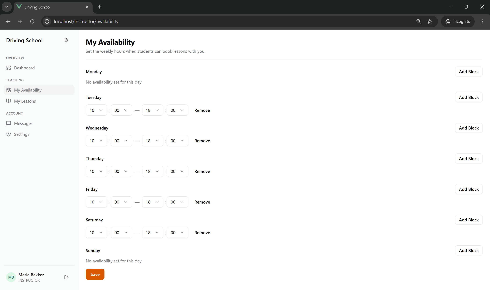

Each instructor specifies which days of the week and times they're available.

### 3. Student books a lesson

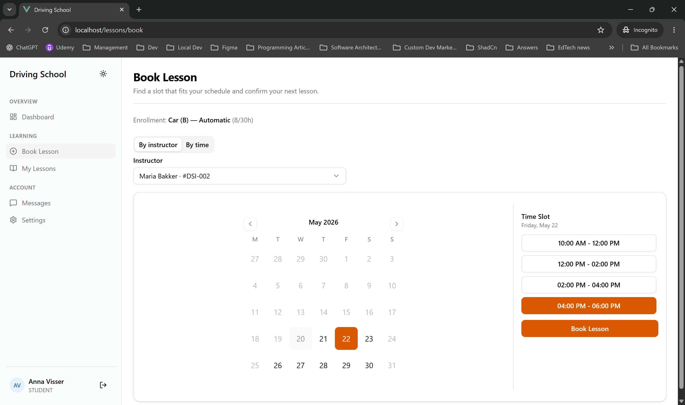

The student can either specify instructor first and select available slots. Or select date first and then select an instructor and time available that day.

### 4. Instructor accepts (or rejects the lesson request)

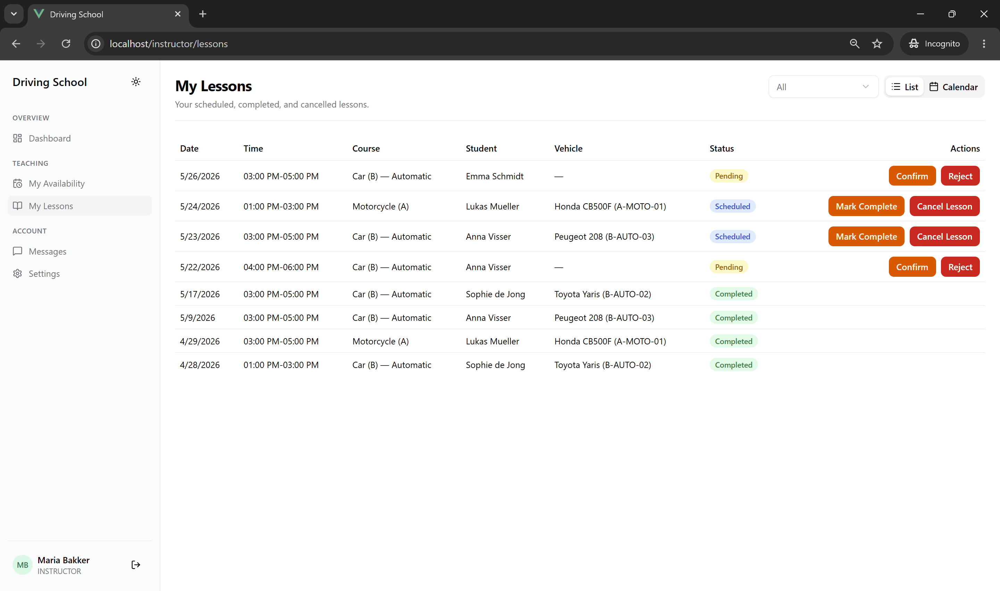

The instructor confirms the booking and picks a car (if multiple available). Instructor can reject the lesson request. Both instructor and student can cancel. If student cancels a confirmed lesson after a deadline set in school config by admin - a fee added to student balance which admin can then waive after payment.

### 5. The lesson shows up on everyone's calendar

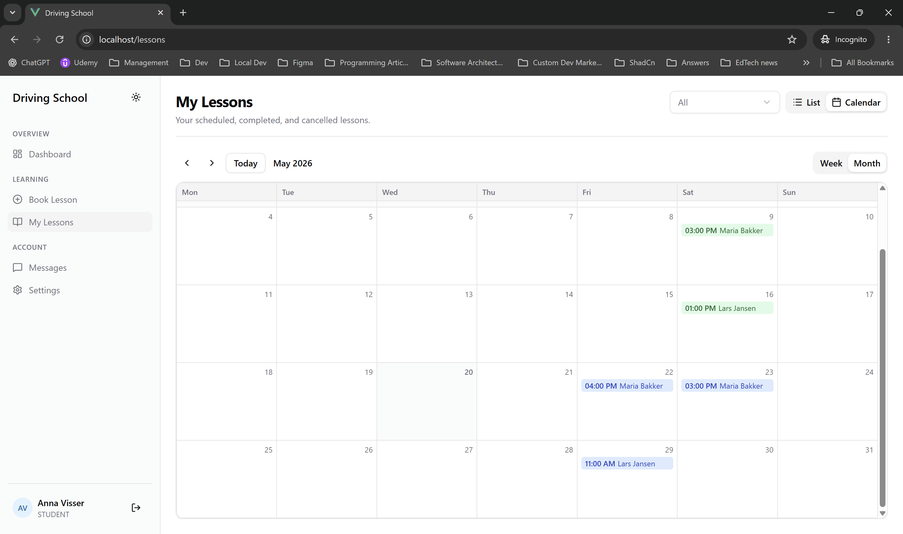

The student and the instructor both see the lesson on their schedule. After lesson is completed, the instructor marks it done and the student's progress goes up.

### 6. Users can message each other

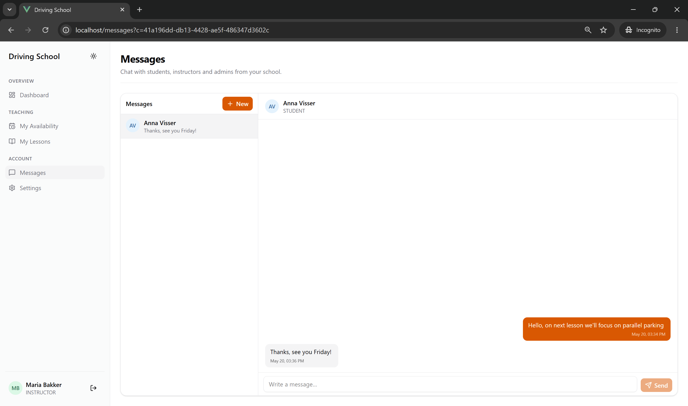

Students and instructors send each other messages. New messages show up instantly thanks to Server-Sent Events.

### 7. Every role has a dashboard with the most important information

<table>
  <tr>
    <td><a href="docs/screenshots/student-dashboard.png">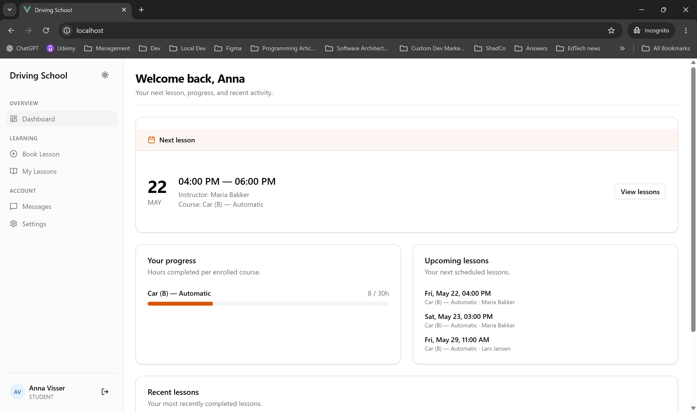</a></td>
    <td><a href="docs/screenshots/instructor-dashboard.png">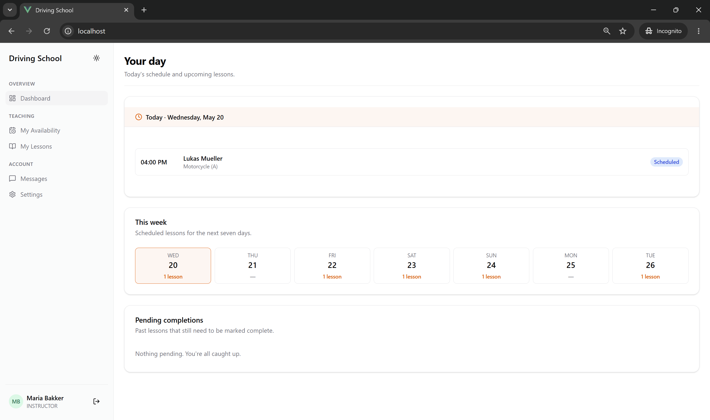</a></td>
    <td><a href="docs/screenshots/admin-dashboard.png">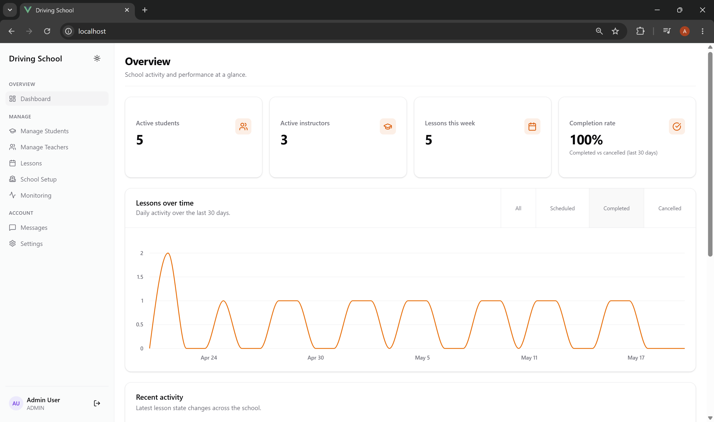</a></td>
  </tr>
</table>

Students see their next lesson and their progress in the course. Instructors see today's lessons and overview of the week. Admins see the school statistics.

### 8. Monitoring

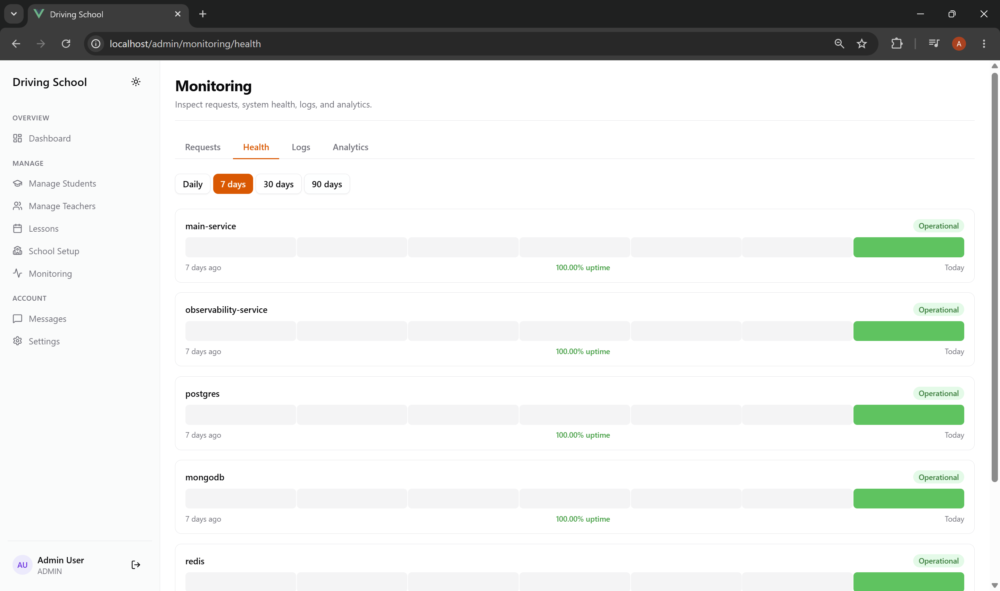

Admins have access to monitoring. They can see both business metrics e.g. which actions users perform most often, and tech metrics e.g. how long each request takes and application logs.

## Engineering highlights

- **Lesson state machine** - `PENDING -> SCHEDULED -> COMPLETED | CANCELLED`, plus `PENDING -> REJECTED`. Each transition validated server-side; completion increments the enrollment's `hoursCompleted`.
- **Bookable-slot SQL** - instructor weekly availability stored as wall time in the school's timezone, projected to UTC via Postgres `AT TIME ZONE` so DST handles itself. Slots filter against instructor / student / vehicle conflicts in one query with `generate_series` + lateral joins. See [lesson.queries.ts](apps/main-service/src/lesson/lesson.queries.ts).
- **Cookie-based JWT auth with refresh rotation and CSRF** - both access and refresh tokens are httpOnly cookies. Additionally a CSRF token for added security
- **Inter-service via BullMQ over Redis** - request logs and app logs flow from main-service to observability-service through the `OBS_LOGS_QUEUE`. The observability service runs scheduled health pings and a daily rollup cron.
- **Live messaging with Server-Sent Events (SSE)** - client receives the message in real time via SSE and sends it via HTTP
- **Shared types with compile-time assertions** - DTO classes use `TypesAreEqual<DTO, SharedDTO>` assertion that fails on build if the class-validator DTO is different from the shared package. This way there's a compile-time guarantee that FE is sending/receiving exact same type that BE declares.
- **PGlite integration tests** - most important flows are tested against a real Postgres-in-process via [test-utils/pglite.ts](apps/main-service/src/test-utils/pglite.ts), including the slot SQL with DST cases, the full lesson lifecycle, cross-tenant isolation, and auth refresh rotation.
- **One-command Docker bootstrap** - `cp .env.example .env && docker compose up` boots the stack with migrations applied, demo data seeded, and an admin user and demo instructor/student users ready to log in. A separate `bootstrap` container handles migrations + seed.

## Repo map

| Path                            | What's there                                                                |
| ------------------------------- | --------------------------------------------------------------------------- |
| `apps/main-service/`            | NestJS API - auth, users, lessons, vehicles, courses, messaging, Prisma     |
| `apps/observability-service/`   | NestJS API - ingest (BullMQ + HTTP), logs/analytics/health/aggregates, cron |
| `apps/web-client/`              | Vue 3 SPA - Pinia, Vue Router, ShadCN-Vue, Tailwind                         |
| `packages/shared-types/`        | DTOs + enums + JWT payload + queue names + utility types                    |
| `packages/nestjs-auth/`         | Cookie-JWT strategy + JwtAuthGuard + RolesGuard + CsrfGuard                 |
| `packages/nestjs-logger/`       | Shared logger with `AsyncLocalStorage` request-context propagation          |
| `packages/eslint-config/`       | Flat-config presets - base + nestjs + vue                                   |
| `packages/tsconfig/`            | Shared tsconfigs - base + nest-app + lib                                    |
| `apps/main-service/src/lesson/` | Lesson lifecycle service, bookable-slot SQL, deadline math                  |
| `apps/main-service/prisma/`     | Schema + migrations + demo seed                                             |

## Next steps

A list of items that could each be a self-contained take-home task - pick by scope and the bit you want to see worked on.

- **Mobile support.** Currently it was developed with only desktop form factor in mind
- **Offline support.** Some features can be useful even without connection to the internet, for example the schedule
- **Push notifications.** Makes sense after mobile support
- **Advanced availability.** Current availability model does not support for example holidays or sick days
- **Car management.** Car can break hence become temporarily unavailable, additionally repairs/complaints can be tracked
- **Online enrollment.** Currently Admin has to create a student. Goal is to have an enrolment page where student can enroll and pay by themselves without visiting the school physically
- **Real payments.** Stripe or other payment systems can be added
- **Transaction management.** Currently there's no records of any transactions. Late cancel fee is just a number which gets changed with no record
- **Additional hours.** Currently the system operates in the term of "course" which is a set amount of hours per price. However driving schools also sell on-demand hours
- **Calendar sync.** Ability to sync lessons to for example Google Calendar
- **Super admin.** Admin now is responsible for both managing business and monitoring IT metrics, which are only really helpful to an IT (super) admin. Super admin should also be able to create a school, which is not currently supported
- **Internal exams.** Some schools require students to pass and internal exam before marking the course as "completed"
- **Language selection.** i18n is already in place, all is left is to translate strings and add a language select
- **Extract shared components.** Some vue components can be extracted and reused
- **Scale messaging.** `MessagingEvents` ([messaging.events.ts](apps/main-service/src/messaging/messaging.events.ts)) is an in-memory `Map<userId, Subject>` - SSE breaks if main-service horizontally scales
